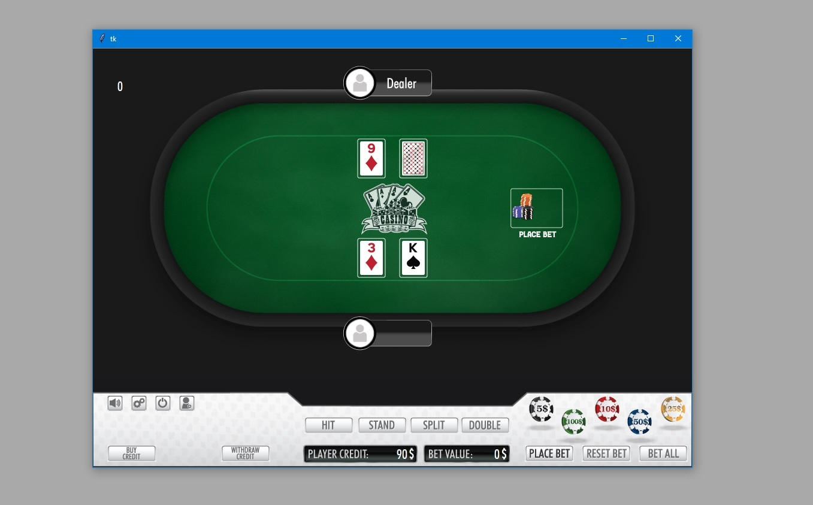

# Python-Tk-BlackJack

<!-- PROJECT LOGO -->
<br />
<p align="center">
  <a href="https://github.com/munteanugabriel25/Python-Tk-BlackJack.git">
    
  </a>

  <h3 align="center">BlackJack Game</h3>

  <p align="center">
    project_description
    <br />
    <a href="https://github.com/munteanugabriel25/Python-Tk-BlackJack.git"><strong>Explore the docs »</strong></a>
    <br />
    <br />
    <a href="https://www.youtube.com/watch?v=i6MF1cKNYbs">View Demo on Youtube</a>
    ·

  </p>
</p>


<!-- TABLE OF CONTENTS -->
<details open="open">
  <summary><h2 style="display: inline-block">Table of Contents</h2></summary>
  <ol>
    <li>
      <a href="#about-the-project">About The Project</a>
      <ul>
        <li><a href="#built-with">Built With</a></li>
      </ul>
    </li>
    <li>
      <a href="#getting-started">Getting Started</a>
      <ul>
        <li><a href="#prerequisites">Prerequisites</a></li>
        <li><a href="#installation">Installation</a></li>
      </ul>
    </li>
    <li><a href="#usage">Usage</a></li>
    <li><a href="#roadmap">Roadmap</a></li>
    <li><a href="#contributing">Contributing</a></li>
    <li><a href="#license">License</a></li>
    <li><a href="#contact">Contact</a></li>
    <li><a href="#acknowledgements">Acknowledgements</a></li>
  </ol>
</details>


<!-- ABOUT THE PROJECT -->
## About The Project

<p float="left">

</p>

Simple blackjack game with sound and graphic animation for betting table actions.
An user can place a bet, select an action after the dealer deals the cards and lastly
checks if the player or the dealer is busted. After that the bet amount is added/removed
form player’s credit.


### Built With

* []()Python 
* []()Adobe Illustrator for UI design


<!-- GETTING STARTED -->
## Getting Started

To get a local copy up and running follow these simple steps.

### Prerequisites

Go to a new folder and then create an virtual environment
* In terminal window type this command
  ```sh
  python3 -m venv /path/to/new/virtual/environment
  ```

### Installation

1. Clone the repo
   ```sh
   git clone https://github.com/munteanugabriel25/Python-Tk-BlackJack.git
   ```
2. Install dependencies packages
   ```sh
   pip install tk
   pip install pygame
   ```


<!-- USAGE EXAMPLES -->
## Usage

When game starts :
* []() Player can buy credit 
* []() Place bet : click on chip icon for desired value. When the value is set click on "PLACE BET" button. If you want to reset bet amount click on "RESET" button.
* []() After a bet is placed, dealer starts dealing cards
* []() Player then can select one action from central buttons bar
* []() When game is over, the program determines the winner and changes credit values.


<!-- ROADMAP -->
## Roadmap

Not defined


<!-- CONTRIBUTING -->
## Contributing

Contributions are what make the open source community such an amazing place to be learn, inspire, and create. Any contributions you make are **greatly appreciated**.

1. Fork the Project
2. Create your Feature Branch (`git checkout -b feature/AmazingFeature`)
3. Commit your Changes (`git commit -m 'Add some AmazingFeature'`)
4. Push to the Branch (`git push origin feature/AmazingFeature`)
5. Open a Pull Request


<!-- LICENSE -->
## License

Not defined


<!-- CONTACT -->
## Contact

Your Name - Munteanu Gabriel - email : munteanugabriel25@yahoo.com

Project Link: [https://github.com/munteanugabriel25/Python-Tk-BlackJack.git](https://github.com/munteanugabriel25/Python-Tk-BlackJack.git)


<!-- ACKNOWLEDGEMENTS -->
## Acknowledgements


<!-- MARKDOWN LINKS & IMAGES -->
<!-- https://www.markdownguide.org/basic-syntax/#reference-style-links -->
[contributors-shield]: https://img.shields.io/github/contributors/github_username/repo.svg?style=for-the-badge
[contributors-url]: https://github.com/github_username/repo/graphs/contributors
[forks-shield]: https://img.shields.io/github/forks/github_username/repo.svg?style=for-the-badge
[forks-url]: https://github.com/github_username/repo/network/members
[stars-shield]: https://img.shields.io/github/stars/github_username/repo.svg?style=for-the-badge
[stars-url]: https://github.com/github_username/repo/stargazers
[issues-shield]: https://img.shields.io/github/issues/github_username/repo.svg?style=for-the-badge
[issues-url]: https://github.com/github_username/repo/issues
[license-shield]: https://img.shields.io/github/license/github_username/repo.svg?style=for-the-badge
[license-url]: https://github.com/github_username/repo/blob/master/LICENSE.txt
[linkedin-shield]: https://img.shields.io/badge/-LinkedIn-black.svg?style=for-the-badge&logo=linkedin&colorB=555
[linkedin-url]: https://linkedin.com/in/github_username
